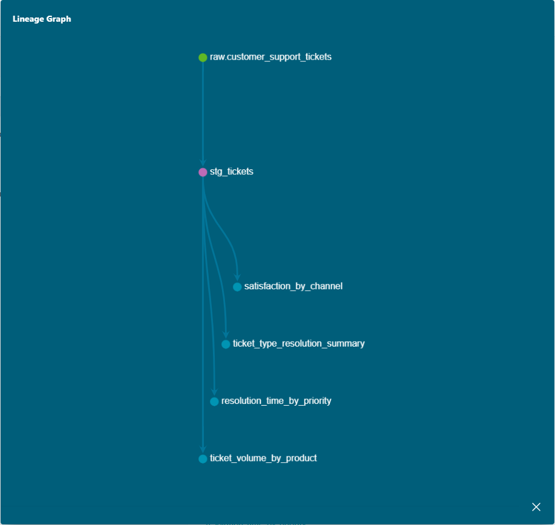

# Customer Support Ticket Analytics Warehouse

An ELT pipeline built with **dbt** and **Snowflake**, transforming raw customer 
support ticket data into analysis-ready models. Built as a portfolio project 
to demonstrate hands-on dbt modeling, Snowflake warehousing, and SQL/ELT 
practices — with a dataset chosen to reflect my own background in customer 
service and content moderation (VCustomer, Concentrix).

## Why ELT, not ETL
Raw ticket data is loaded into Snowflake **unmodified** first, then transformed 
in-warehouse using dbt. This Extract → Load → Transform sequence (rather than 
transforming before loading) is the pattern dbt is purpose-built for, and 
matches how modern cloud data warehouses are typically used.

## Dataset
[Customer Support Ticket Dataset](https://www.kaggle.com/datasets/suraj520/customer-support-ticket-dataset?resource=download) — ~8,469 
customer support tickets for technology products, covering hardware, 
software, billing, and account issues, with priority, channel, resolution 
time, and satisfaction fields.

**Note:** `Customer Name` and `Customer Email` columns were excluded during 
staging, since they weren't needed for any business question this project 
answers.

## Architecture

- **Staging** (`stg_tickets`): light cleanup — renamed columns, typed casts, 
  excluded PII fields
- **Marts**:
  - `resolution_time_by_priority` — average handling time and satisfaction by priority
  - `satisfaction_by_channel` — average satisfaction and volume by support channel
  - `ticket_volume_by_product` — ticket volume and satisfaction by product
  - `ticket_type_resolution_summary` — handling time and satisfaction by ticket type

## Data Quality Note
`First Response Time` and `Time to Resolution` are stored as timestamps, but 
a significant number of rows show `Time to Resolution` earlier than 
`First Response Time` — suggesting these fields may not represent strictly 
sequential events in this dataset. Affected rows are excluded from average 
handling-time calculations (visible via an `excluded_negative_rows` column) 
but retained in total ticket counts for transparency.

## Testing
dbt tests cover:
- `unique` / `not_null` on `ticket_id`
- `accepted_values` on `ticket_priority` and `ticket_channel`

## Performance Optimization Experiment: Warehouse Sizing

I tested the `resolution_time_by_priority` aggregation query on both an X-Small 
and a Small Snowflake warehouse, running each 3 times to account for variance.

| Warehouse | Run 1 | Run 2 | Run 3 | Average |
|-----------|-------|-------|-------|---------|
| X-Small   | 37ms  | 36ms  | 36ms  | 36.33ms |
| Small     | 38ms  | 37ms  | 37ms  | 37.33ms |

**Finding:** At this dataset's scale (~8,500 rows), increasing warehouse size 
produced no performance benefit — execution times were statistically 
equivalent (within normal run-to-run variance), with Small even showing a 
marginal increase. This reflects Snowflake's architecture: warehouse sizing 
delivers benefits primarily for large-scale data volumes or high query 
concurrency, where additional compute nodes can meaningfully parallelize 
work. For small, single-query workloads like this one, right-sizing means 
staying on the smallest warehouse that meets latency needs — scaling up 
here would only increase cost without improving performance.

## How to Run
1. Load `data/customer_support_tickets.csv` into a Snowflake `RAW` schema using Snowsight's "Load Data" wizard (Data → Databases → SUPPORT_DB → RAW → Create → Table → From File)
2. `cd support_dbt_project`
3. `dbt debug` — confirm connection
4. `dbt run` — build all models
5. `dbt test` — run data tests
6. `dbt docs generate && dbt docs serve` — view documentation and lineage

## Tech Stack
Snowflake · dbt Core · SQL
